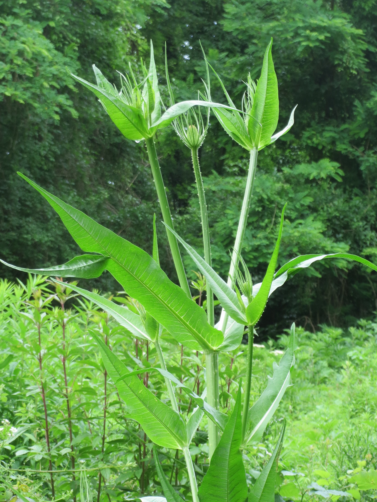
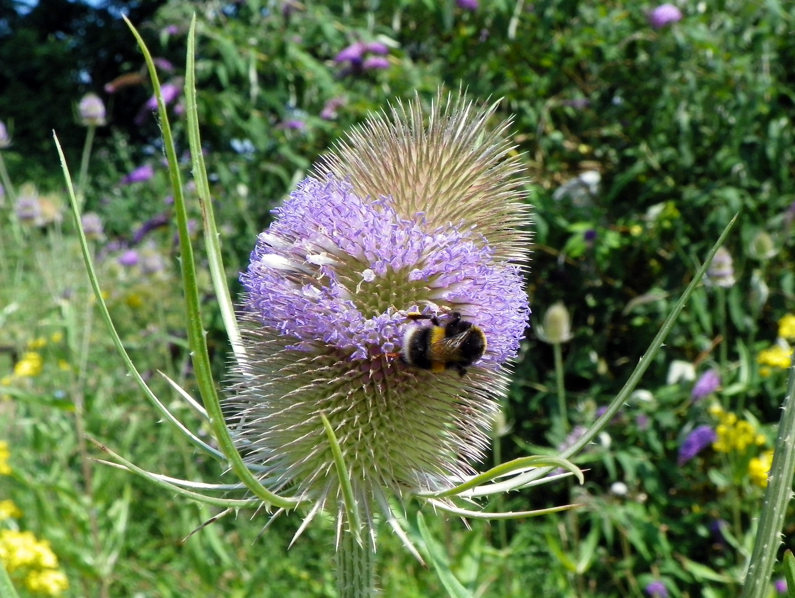
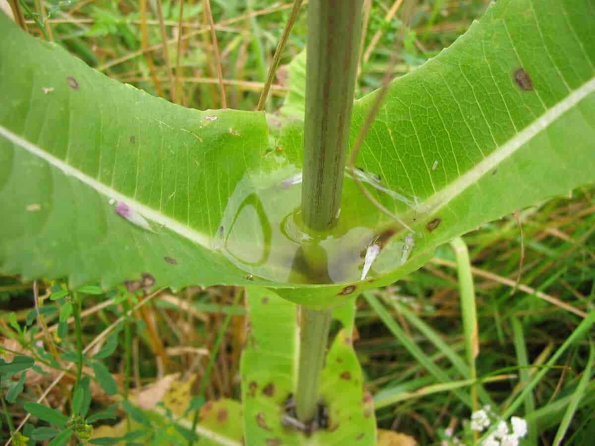

# Teasel phytotelmata metabarcoding

Data processing and analysis for the manuscript **"Vecchi M. (2024). Diversity patterns of biotic communities from teasel (** ***Dipsacus fullonum***  **L.) phytotelmata through DNA metabarcoding. Hydrobiologia"**  
  
Teasels (biennial plants in the genus *Dipsacus*, see photos below) are widely distributed in Europe and produce tall stems in their second years of life which (in some species) bear multiple phytotelmata (see photo below) in the form of cup-shaped leaf axils. Those leaf-axils can retain water, however due to the short lived nature of the plant stems, those water reservoirs last only for a few months in spring-summer [^1].  
This study aims at producing the first DNA metabarcoding dataset of *Dipsacus fullonum* phytotelmata and to answer keys question that emerged from previous research [^1] [^2] regarding communities of teasel phytotelmata.  


| Teasel plant  [^3] | Teasel flower [^4] | Teasel phytotelm [^5] |
| ------------- | ------------- | ------------- |
||||


## How to run
The intermediate files and the analysis results are already present in this repository, however if you wish to re-run the analysis clone this repository on your computer and delete all the intermediate and results files inside their folders.  

1 - Download the fast.gz files with the reads from NCBI SRA (Bioproject PRJNA1177995 - they are quite heavy so they are excluded from this Github repository).  
2 - Download the SILVA r138 training set downloaded from: http://www2.decipher.codes/Classification/TrainingSets/SILVA_SSU_r138_2019.RData, move it to the *databases* folder and rename it as SILVA_SSU_r138.rds

3 - Create and activate a conda environment (You need conda/mamba installed in your system), in your bash shell type:
```
mamba env create -f environment.yml
conda activate DP_metabar
```

4 - Then make all the scripts exectuable and run them:
```
chmod +x code/*
bash code/000_run_all.bash
```


[^1]: Oboňa, J., Svitková, I., Fogašová, K., Manko, P., Rendoš, M., & Svitok, M. (2024). Water-filled leaf axils in teasel plants: A study of often overlooked aquatic habitats. *Limnologica*, 105, 126157. https://doi.org/10.1016/j.limno.2024.126157
[^2]: Vergne, A., Giraud, E., Camuel, A., Bardot, C., Billard, H., Bouquet, C., ... & Lehours, A. C. (2023). The Pharaoh's snakes of the teasel: New insights into F rancis Darwin's observations. *Ecology*, 104(5). https://doi.org/10.1002/ecy.4030
[^3]: Credit: Andreas Rockstein CC BY-SA 2.0 https://www.flickr.com/photos/74738817@N07/  
[^4]: Credit: Peter O'Connor CC BY-SA 2.0 https://www.flickr.com/photos/anemoneprojectors/29097367541/in/photostream/  
[^5]: Credit: Av Warden. CC BY SA 3.0 https://snl.no/kardeborre  
